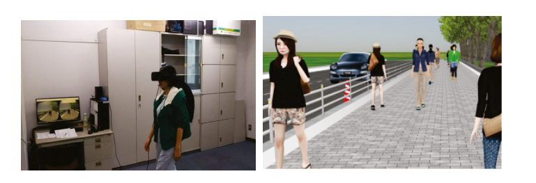
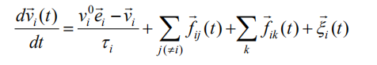
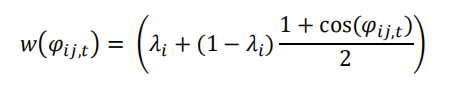
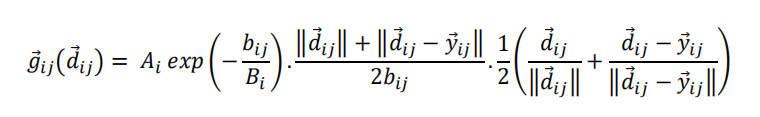
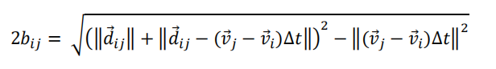
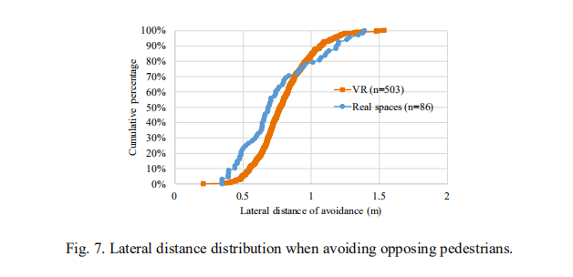
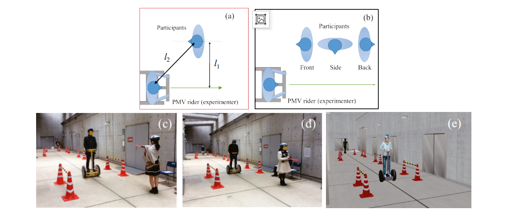

# 虚拟现实 -- Homework 1

### 姓名：陈明亮

### 学号：16340023

## 所选论文：Applicability of Virtual Reality Systems for Evaluating Pedestrians’ Perception and Behavior

## 一、科学问题与问题定义

1. 为了恰当地设计行人空间，重要斟酌行人的平安性和温馨性。近年来，随着虚拟现实`VR`技术的飞速发展，更接近`VR`用户的物体再现变得更加容易。因此，从行人的角度来看，`VR`系统有望成为评估安全性和舒适性的重要工具。特别是，`VR`使用户不仅可以与普通车辆进行交互，还可以与周围的行人或个人移动车辆进行交互，因此，预期会有更广泛的应用。然而，到目前为止，大多数验证`VR` 性能的尝试都仅限于遇到普通车辆的行人。本研究对行人对其他行人和个人机动车辆的认知和行为特征进行了分析。在`VR` 和真实空间中测量的数据。结果表明，当车辆从正面和背面接近`VR`参与者时，从个人移动车辆对距离和主观危险的感知在 VR 和真实空间中并不不同, 虽然主观危险往往对`VR`参与者和个人移动车辆之间的横向空间不太敏感。还显示，`VR`参与者在避免其他行人时，往往比实际空间保持更大的横向间隙。

   ​

2. 为了正确设计步行空间，提出了各种行人交通模拟器，以评价交通流效率。同时，安全和舒适也是衡量步行空间质量的重要因素, 尤其是在共享空间中，不仅有与行人互动的可能性，也有缓慢的移动车辆，如周期，轮椅，个人运输车，和其他新开发的个人移动车辆。由于在进行实验尤其是评估危险情况方面有许多困难，利用虚拟现实`VR`技术的兴趣越来越大。

   ​

   然而，需要解决几个问题，以确认行人`VR`工具是否可以为上述目的可靠。首先，如果参与者对周围行人的运动感到不安，它可能会影响考官试图评估其他舒适因素。因此，需要一种基于人类感知的具有自然行为的行人模型。第二，应该明确虚拟现实中参与者主观感知的特点。第三，有必要通过与现实世界中参与者对周围共享空间用户的反应来评估参与者的实际行为。

   ​

3. 一个`VR`环境开发了一个`VR`软件和一个头部显示器。主题行人佩戴显示装置，可以在实验室内自由行走, 受试者的头部位置和方向由传感器跟踪，并实时反映在`VR`显示屏中 (大约每 0.1 秒)，因此，`VR`参与者感觉好像他/她走在`VR`空间。在`VR`中实现了两种类型的周围行人行为: 预定模型和交互模型。前者只是遵循预定的固定轨迹，而后者则决定行人在每个时刻的加速度向量，与位置、方向相互作用。

   

## 二、算法描述

1. 互动步行模型的表现对被试的现实感有很大的影响。在这项研究中，Johannson等人修改的社会力量模型被用作基本模型，因为包含改善行人机动表现所需的预期因素，这个模型将行人`i`在时间`t`处的加速度(等式左部)描述为向目的地施加的驱动力的总和，来自其他行人的排斥（或社会）力，以及一个随机项，如以下等式所示，即为改进的社会力量模型.

   

   ​

2. 约翰森模型的规范II考虑了相对速度对排斥力的影响。这个排斥力可以用以下公式进行计算：

   

   

   

   

3. 虽然约翰森模型的预期因素能够准确地描述实际行为，但是仍然需要调整以从主体的角度来表现更“现实”的行为。首先，模型只考虑当前状态来计算加速度。因此，行人的速度经常波动受参与者轻微动作的强烈影响。尤其是当行人靠近虚拟现实参与者，受到参与者更大的排斥力的影响，这会降低现实感。要考虑的第二个点是身体方向。行人经常变换保持身体方向的速度方向。因此，如果物体和速度方向是同样，受试者在实验中可能会感到奇怪。

   ​

4. 为了解决第一个问题，一种简单的参与者运动预测方法以及实时的采用平滑法。基本策略是分别处理社会力量模型计算的行人位置和虚拟现实空间中绘制的位置。行人的位置记录在社会力量模型预测了过去α秒和未来α秒的位置。平均值在虚拟现实空间中绘制了个位置。程序概述如下。在本实验中，α设为0.2s。根据实验前受试者的意见。

   * 步骤1：根据受试者在过去α秒内的轨迹记录，他/她的位置和速度直到α几秒钟后被推断出来。
   * 步骤2：利用该轨迹，所有模拟行人在α秒后的轨迹由社会力模型。
   * 步骤3：每个行人从α秒前到α秒后位置的算术平均值为确定的。这些值用作虚拟现实空间中的行人位置。

   对于第二点的改进，根据过去和未来的平均值给出了身体的方位，以及速度方向。

   在此虚拟现实环境下，进行了两种实验。第一个目标是理解人们的感知；第二个目的是分析行人的行为。实验细节和结果将在以下部分中描述。

## 三、应用场景

1. 实验结果

   首先，测量了虚拟现实实验参与者的平均速度，最大速度为0.7米/秒，远低于现实世界中的平均步行速度，(交叉口处约1.3 m/s)。这可能是因为参与者知道有限的规模在实验室中，头戴式显示器与电线相连，因此，他们在在虚拟现实中行走比在`RS`条件下行走。

   下图显示了当其他行人相互避开时，他们与其他行人的横向距离的比较。侧向距离是根据人体的中心来测量的。`VR`和`RS`中的横向距离分布是相似的。而`Rs`的变化较大。这是因为在虚拟现实中，步行空间在可步行区域是有限的，因此限制了虚拟现实中行人行为的自由度。应该注意的是，较小的横向距离在`Rs`中观察频率更高。可能的原因是VR参与者看不到自己的身体，也看不到自己的身体。测量别人和自己身体之间的距离。此外，他们的视野是有限的，不能清楚地看到他们旁边的行人。

2. 实验总结

   本文比较了虚拟现实和虚拟现实中行人的认知和行为。在第一个实验中，参与者同样在虚拟现实中认识到PMV和他们自己之间的距离，当PMV从前面或后面接近他们。在侧面场景中，参与者在虚拟现实中比在虚拟现实中感受到更多的危险。在第二个实验中，研究了行人速度和避让行为。结果表明参与者在回避他人时往往有更多的侧边空白。两个实验的结果都表明显示器视野的限制可能会影响行人的感受，尤其是当周围环境从侧面来，让行人保持更多的避让空间。更一般和需要综合分析，找出虚拟现实和虚拟现实中知觉与行为的定量关系。但是，如果将来可以使用具有更宽视野的显示器，则可以解决这一限制。需要注意的是，第二次实验中的虚拟现实数据和遥感数据的条件是不同的，以及结果需要仔细检查。然而，结果并不与第一次实验相矛盾，而且为虚拟现实实验的规划提供重要建议。在未来的工作中，需要更详细的比较在行为分析中使用相似条件下的数据。

3. 实验应用性

   本文所开设的实验目的在于研究行人在街道上行走时，与其余行人的回避距离的检测，以及行人对来往车辆的危险感知，来预测在真实生活中，人们对周围环境的感知能力，与事故的发生概率大小。此项技术可用于评价行人感知和行为采取，在当今人人皆为低头族的社会，不仅可以检测事故发生的情况，同时也能根据数据预测，为人们敲响安全警钟。